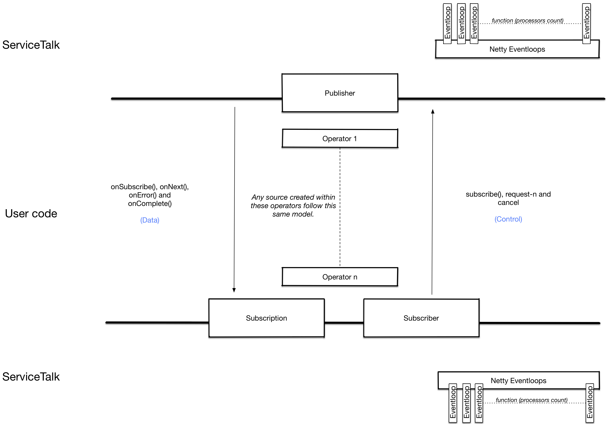

= May I block?

`TL;DR; By default, users are free to write blocking code when using ServiceTalk.`

== Background

ServiceTalk uses link:https://netty.io[Netty] under the hood which uses the
link:https://en.wikipedia.org/wiki/Event_loop[EventLoop programming construct]. A drawback of this construct is that
any potentially long running work (blocking calls, intensive computations, etc) that is done on the `EventLoop`
negatively impacts the processing of all subsequent tasks. This is the reason why writing blocking code is usually
discouraged when using netty.

== Reality

Writing non-blocking code is hard and requires continuous, significant effort to make sure that no code path interacting
with the event loop is invoking any blocking code. In practice, even the most careful application owners are
occasionally surprised that they have some blocking code in their applications.

== ServiceTalk approach

We want ServiceTalk to be an approachable library for all developers. Providing a simple message that
"blocking is safe by default" lowers the bar to entry and eases the operational burden of continuously making sure that
no blocking code exists in any path. There are no exceptions to this rule for ServiceTalk users, although the bar is
higher for <<ServiceTalk developers>>.

=== Completely non-blocking applications?

Although writing completely non-blocking applications is hard in practice, still there are reasons and usecases to
reduce thread hops and do all application processing on the event loop. ServiceTalk makes it possible to write such
applications but requires explicit <<Opt-in to run on event loop, opt-ins>> to avoid inadvertently blocking the
event loop.

== How is it safe to block?

Simply put, ServiceTalk makes sure that no user code is called on the event loop. In order to do that, it uses an
link:../servicetalk-concurrent-api/src/main/java/io/servicetalk/concurrent/api/Executor.java[Executor] to __offload__
invocation of user code out of the event loop to a different thread.

=== User code and Eventloop

Although the outcome is simple that no user code should run on the eventloop, implementation of this offloading is
either naive hence sub-optimal or fairly complex. ServiceTalk internally does the heavy lifting to make sure that it
does not offload more than what is required. In other words, it reduces offloading when it can deduce that no user code
can interact with the event loop on a certain path.

ServiceTalk abstracts interaction with the event loop using its
link:../README.adoc#asynchronous-primitives[asynchronous primitives] and hence those interactions can be expressed as
the signals that are exchanged on those asynchronous primitives as elaborated in the diagram below:

ServiceTalk uses different `publishOn` and `subscribeOn` operators on these asynchronous primitives to implement
offloading. Implementation details of those operators are out of scope of this document but the usage of these operators
is encapsulated in an
link:../servicetalk-transport-api/src/main/java/io/servicetalk/transport/api/ExecutionStrategy.java[Execution Strategy]

==== Execution Strategy

An link:../servicetalk-transport-api/src/main/java/io/servicetalk/transport/api/ExecutionStrategy.java[Execution Strategy]
has two primary purposes:

. Define which interaction paths require offloading.
. Optionally specify an link:../servicetalk-concurrent-api/src/main/java/io/servicetalk/concurrent/api/Executor.java[Executor]
to use for offloading. In absence of a specified `Executor`, ServiceTalk will use a default `Executor`.

At a general transport layer (no application level protocol), only two offload paths are available:

. Sending data to the transport.
. Receiving data from the transport.

However, different protocols, eg: link:../servicetalk-http-api/docs/Blocking.adoc[HTTP] may provide more sophisticated
offloading paths that can be controlled by a strategy.

==== Influencing offloading decisions

As explained above, ServiceTalk does the heavy lifting of determining the optimal offloading strategy. This optimal
strategy is determined based on different inputs as outlined below:

. __link:../README.adoc#programming-paradigms[Programming model]__: A certain programming model may reduce the paths
user code can interact with event loop and hence make some offloading redundant.
. __Presence of user code__: ServiceTalk is flexible and allows users to add code at different places.
Presence of any user code is deemed as unsafe and hence require offloading. If users are sure the added code does not
block, they can declare so through the constructs provided at the
link:../servicetalk-http-api/docs/Blocking.adoc[protocol level].
. __Override execution strategy__: ServiceTalk provides a way for users to override the
link:../servicetalk-transport-api/src/main/java/io/servicetalk/transport/api/ExecutionStrategy.java[Execution Strategy]
used for a client/server. This disables all intelligence around finding the optimized strategy and just use the provided
strategy.

==== Opt-in to run on event loop

ServiceTalk acknowledges that [.underline]#writing completely asynchronous code is hard and is __not__ an
"all or nothing" decision.#
Practically, applications will have a mixed profile such that some paths are completely asynchronous and some paths have
blocking code. This is the reason it provides ways to selectively opt-in for disabling offloading for the same
client/server. This selective opt-ins are specific to protocols and hence elaborated under
link:../servicetalk-http-api/docs/Blocking.adoc[HTTP]. In additional there is a way to override the strategy for a
 client/server but it comes with additional responsibility from the user assuming "you know what you are doing".

=== ServiceTalk developers

Internals of ServiceTalk still discourages blocking code and hence should be avoided while contributing to ServiceTalk.
